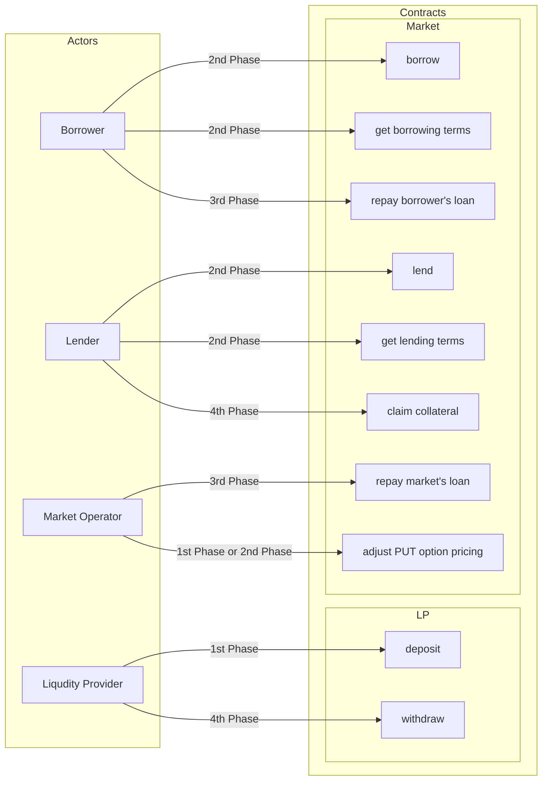
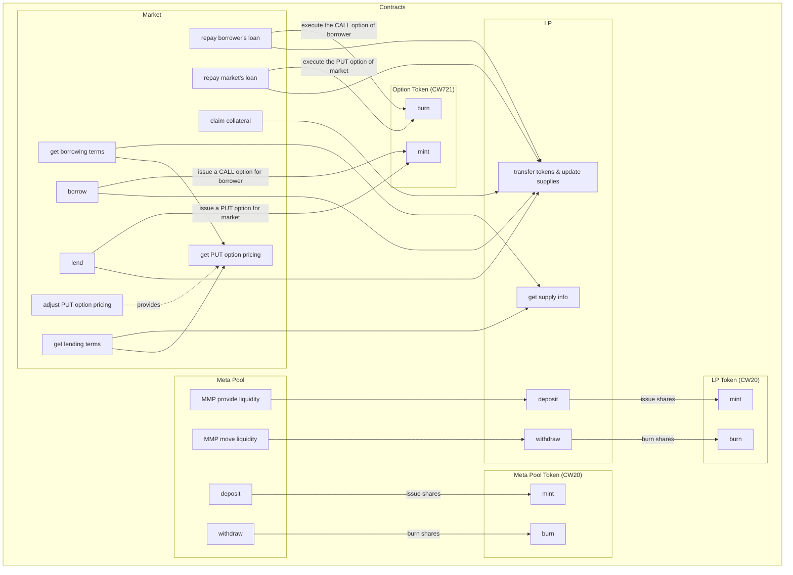

# Protocol implemenation

## Public interface design

## Non-public (internal) interface design

Requirements applied:

1. The Market contract is deployed and managed by its Maintainer.
    1. Maintenance is about setting market parameters accordingly to current market conditions.
2. The Market contract is the owner of:
    1. the Liquidity Pool (LP) contract;
    2. the Option Token (OT) contract.
3. The Liquidity Pool contract:
    1. the custodian of all liquidity coming from Liqudity Providers, Borrowers, Lenders, Meta Pool;
    2. is the owner of the Liquidity Pool Token (LPT) contract;
    3. enables the Market contract to transfer assets in/out its custody, as required.
4. The Liquidity Pool Token contract is:
    1. held by Liquidity Providers and Meta Pool while they have their liquidity locked in the Liquidity Pool;
    2. used to withdraw pro-rated liquidity from the Liquidity Pool.
5. The Option Token contract is:
    1. held by either, a Borrower (CALL option), or Market Contract (PUT option);
    2. used to execute the option it describes.
6. The Meta Pool contract is deployed and managed by its Maintainer (MMP):
    1. Maintenance is about moving liquidity from and to Multiple Liquidy Pools;
7. The Meta Pool contract is:
    1. the custodian of all the liquidity coming from Liquidity Providers and held as different Liquidity Pools Tokens;
8. The Meta Pool Token contract is:
    1. held by Meta Pool's Liquidity Providers while they have their liquidity locked in the Meta Pool;
    2. used to withdraw pro-rated liquidity from the Meta Pool;

