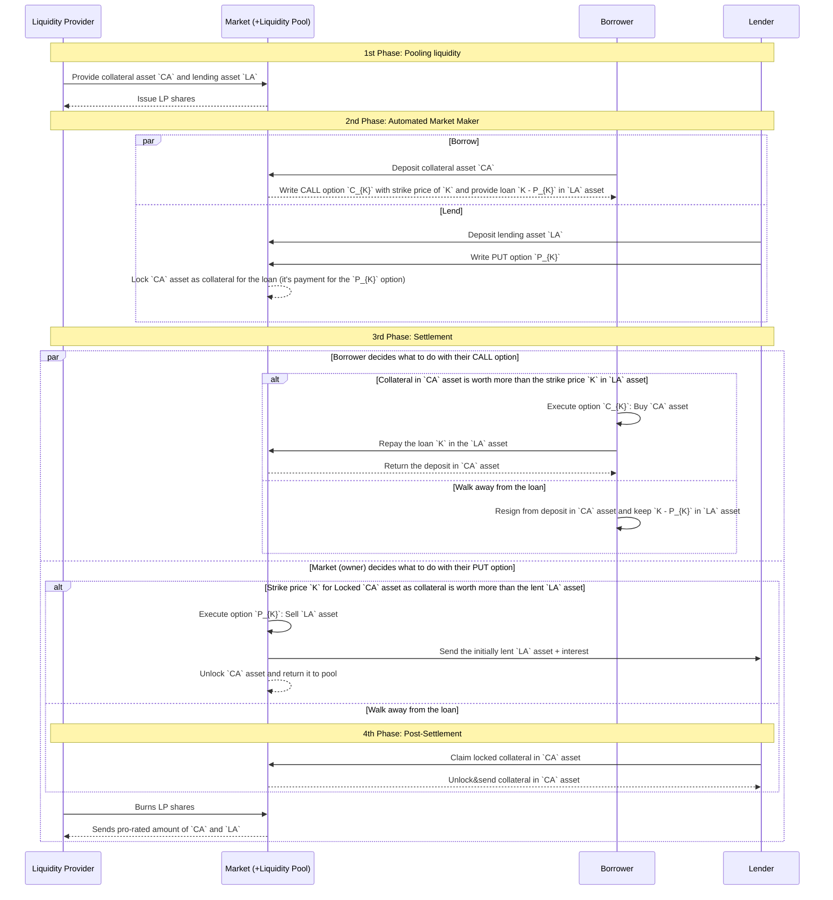

# Protocol specification

## Diagram

A sequence diagram showing available interactions among actors in different phases of a particular market.

## Roles

### Borrower

Deposits collateral asset into the liquidity pool to receive a zero-liquidation loan and an option to reclaim the collateral asset for a pre-agreed repayment amount once the option expired.

### Lender

Deposit lent asset into the liquidity pool and gives it the option for a pre-agreed repayment amount in the lent asset (including interest). Alternatively, after the option expired, can claim pre-agreed amount of the collateral asset as a repayment.

### Liquidity Provider

Provides liquidity to the liquidity pool (in both, the collateral asset and the lent asset) and receives pool shares back. Can use shares to withdraw their liquidity 

### Liquidity Pool

Enables Borrowers to borrow, Lenders to lend, and Liquidity Providers to provide liquidity.

Can earn fees from borrowing assets, and pay interest for lending assest. Remaining revenue is split between pool shareholders.

### Liqudity Pool Operator

Maintains the Liqudity Pool. They take care of setting up correct configuration, and having it updated while changing market conditions.

They can also exectute PUT options which were written by Lenders.

## Liquidity Pool phases

### 1. Pooling liquidity

Liquidity providers can deposit assets into the pool and receive pool shares in return.

No borrowing, nor lending is possible yet.

### 2. Automated Market Maker

Once sufficient liquidity is provided, the pool enters the active phase.
It lets Borrowers borrow assets, and Lenders lend assets.

### 3. Settlement

All borrowing, and lending has ended by this phase.

Borrowers can execute their CALL options repay their loans.

The Liqudity Pool Operator decides which PUT options are worth executing, and executes them accordingly.

### 4. Post-settlement

Lenders who written PUT options that didn't get execututed can now claim the collateral asset from the Liquidity Pool.

Liquidity Providers can now burn their pool shares in order to withdraw remaining liquidity from the Liquidity Pool.
